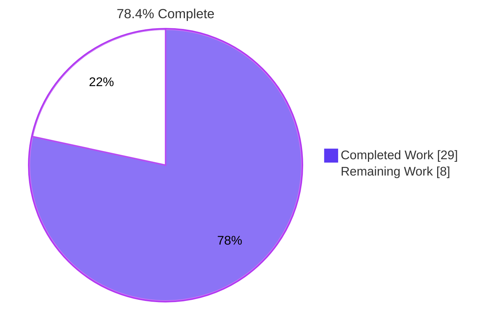
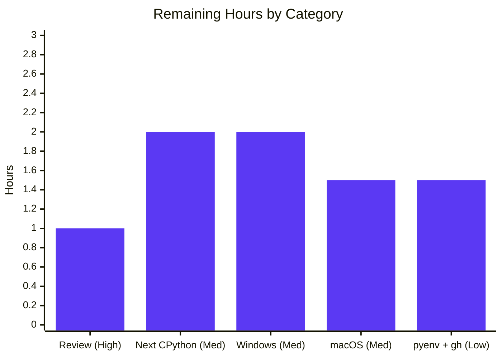

# 1. Executive Summary

## 1.1 Project Overview

This project adds `hello.py`, a single-module Python console program that prints `Hello World` on CPython 3.14.7, the latest stable Python release, with automated proof that it does so. It serves developers and learners confirming a Python 3.14 toolchain end to end. The work sits in the existing first-contributions repository: three new root files (`hello.py`, `test_hello.py`, `.python-version`) and a "Hello World in Python" section in `README.md` covering installation on Linux, macOS and Windows, the version check, the run and the tests. The program has no dependencies, input, network access or stored state.

## 1.2 Completion Status



| Metric | Value |
|---|---|
| Total Hours | 37 |
| Completed Hours (AI + Manual) | 29 (29 AI + 0 manual) |
| Remaining Hours | 8 |
| Percent Complete | 78.4% |

29 hours completed out of 37 total hours = 78.4% complete. Every AAP deliverable is complete; the remaining hours are sign-off, the next CPython release, and install routes on platforms not yet exercised.

## 1.3 Key Accomplishments

- [x] `hello.py` prints exactly `Hello World` and the platform line ending, exit 0, empty stderr, on Windows (13 bytes) and Ubuntu 24.04 (12 bytes)
- [x] CPython 3.14.7 confirmed as the latest stable final and pinned in `.python-version`
- [x] `test_hello.py` passes 2 of 2 on 3.14.7; older interpreters fail its version floor, naming both versions
- [x] The output test catches every mutation of text, line ending, stderr, exit code, and a 30-second hang
- [x] Malformed or oversized pins fail loudly without echoing the file's content
- [x] README Linux uv and source-build routes work verbatim for a clean Ubuntu user
- [x] No input, network, file writes or shell use at runtime; interpreter provenance verified
- [x] Pre-existing tutorial, links and contributor workflow unchanged

## 1.4 Critical Unresolved Issues

0 of 7 AAP pass criteria (AAP 0.11.5) are open. 9 non-blocking items remain, grouped below.

| Issue | Impact | Owner | ETA |
|---|---|---|---|
| Install routes documented but never run on their target platform (4): macOS installer and uv route; Windows install, update and PATH/alias remedies; pyenv route; the `gh attestation verify` step as written | A reader on those paths could hit an unverified step; the program and tests are unaffected | Human developer | 5 h (Section 2.2) |
| Pinned CPython 3.14.7 carries unreachable upstream advisories and stops being "latest" when 3.15.0 ships on 2026-10-01 (1) | FR-2 lapses after that date; the next final release is expected to clear the advisories | Human developer | 2 h, on or after 2026-10-01 |
| Behaviours kept because the AAP constrains them (4): piped uv installer exits 0 on a failed download; closed stdout exits 0 silently; macOS `.pkg` step has no checksum command; a missing `.python-version` traceback shows its absolute path | Low; each is documented or by design (Section 5.2) | Repository owner | No work required |

## 1.5 Access Issues

| System/Resource | Type of Access | Issue Description | Resolution Status | Owner |
|---|---|---|---|---|
| GitHub CLI account | Credential | The README's `gh attestation verify` step needs a signed-in `gh`; none was available, so the uv installer attestation was confirmed through the public attestation API instead | Open; any GitHub account resolves it | Human developer |
| macOS machine | Environment | No Mac was available to run the macOS installer and uv routes | Open | Human developer |
| Clean Windows machine | Environment | The build host's shared Python runtime cannot be installed, updated or uninstalled, so the README's Windows install and update steps were not run | Open | Human developer |

## 1.6 Recommended Next Steps

1. [High] Review and merge, deciding README placement, pin grammar and install-route scope (Section 5.2).
2. [Medium] On or after 2026-10-01, move to CPython 3.15.0 via the README token list and re-run acceptance.
3. [Medium] Run the Windows install-manager flow on a clean machine.
4. [Medium] Run the macOS installer and uv routes on a Mac.
5. [Low] Run the pyenv route and the `gh`-attested uv installer on Linux.

# 2. Project Hours Breakdown

## 2.1 Completed Work Detail

| Component | Hours | Description |
|---|---|---|
| Interpreter resolution and version pin | 2 | CPython 3.14.7 confirmed on python.org as the latest stable final (3.15.0rc2 excluded); `.python-version` holds `3.14.7` and one LF (7-byte committed blob); host interpreter confirmed as the default GIL build (AAP 0.3.1.1, Component C) |
| Hello World program | 1 | `hello.py`: module docstring, `main() -> None` calling only `print("Hello World")`, `__main__` guard, no imports and no version guard (Component A) |
| Acceptance test suite | 5 | `test_hello.py`: `test_prints_hello_world` runs `hello.py` in a subprocess and asserts exit 0, exact bytes built from `os.linesep`, and empty stderr under a 30 s timeout; `test_interpreter_meets_pinned_version` reads the pin with a size bound and shape check and asserts the interpreter floor (Component B, AAP 0.11.4) |
| Run documentation | 10 | `README.md` "Hello World in Python" (181 lines): Linux uv, source build and pyenv routes; macOS installer and uv; Windows install manager in three steps; SHA-256 and Sigstore verification; version, run and test commands; newer-release token list (Component D) |
| Acceptance verification | 5 | Version, run, byte, stderr and unittest checks on Windows and on an Ubuntu 24.04.5 VM; older-interpreter rejection; the README uv route and a full source build run verbatim (AAP 0.11) |
| Test adequacy verification | 2 | Mutation matrix against `hello.py` and more than 20 pin cases against the version test |
| Security and supply-chain verification | 2.5 | Runtime isolation probes (audit hooks, firewall-blocked interpreter, network namespace, strace, process monitor), interpreter provenance and signature checks, upstream advisory review (AAP 0.2.1, 0.10.2) |
| Code quality and continuity | 1.5 | PEP 8 and PEP 257 checks, ASCII/LF hygiene, scope exclusions (AAP 0.6.3), tutorial, link and workflow continuity |
| **Total** | **29** | |

## 2.2 Remaining Work Detail

| Category | Hours | Priority |
|---|---|---|
| Review and merge sign-off: README placement, pin grammar and install-route scope (Section 5.2) | 1 | High |
| Next stable CPython release: update `.python-version` and every README token (README.md:372-389), re-run acceptance on Linux and Windows | 2 | Medium |
| Windows install-manager flow on a clean machine: winget or Store install, `pymanager install` and `--update`, PATH and alias remedies | 2 | Medium |
| macOS installer and uv routes on a Mac, with version, run and test commands | 1.5 | Medium |
| pyenv route and `gh`-attested uv installer on Linux | 1.5 | Low |
| **Total** | **8** | |

## 2.3 Hours Calculation

- Completed: 2 + 1 + 5 + 10 + 5 + 2 + 2.5 + 1.5 = **29 hours**
- Remaining: 1 + 2 + 2 + 1.5 + 1.5 = **8 hours**
- Total: 29 + 8 = **37 hours**
- Completion: 29 / 37 × 100 = **78.4%**

Every AAP requirement is classified Completed. The portability requirement (Linux, macOS and Windows) is verified on Linux and Windows only, which is why macOS, Windows install and pyenv runs appear as remaining path-to-production work. Estimates are high confidence for the release bump and review, and medium confidence for the platform runs, which depend on machine availability.

# 3. Test Results

All results below were executed on the delivered tree (HEAD `d29065a2`) with CPython 3.14.7 on Windows Server 2022, from the repository root.

| Area / Category | Framework | Tests | Passed | Failed | Coverage | What This Proves |
|---|---|---|---|---|---|---|
| Acceptance suite, `py -V:3.14 -m unittest -v` | unittest | 2 | 2 | 0 | Not measured (no coverage tool; AAP 0.6.3) | The program prints exactly `Hello World` and the platform line ending, exits 0 with empty stderr, on an interpreter at or above the pin |
| Direct invocation, `py -V:3.14 test_hello.py -v` | unittest | 2 | 2 | 0 | Not measured | The `unittest.main()` guard runs the suite without discovery |
| POSIX form in Git Bash, `python3.14 -m unittest` | unittest | 2 | 2 | 0 | Not measured | The versioned `python3.14` command resolves 3.14.7 and passes the same suite |
| Older-interpreter rejection, `py -V:3.13 -m unittest -v` | unittest | 2 | 1 | 1 (expected) | Not measured | The version floor rejects 3.13.13 with `(3, 13, 13) not greater than or equal to (3, 14, 7)`, while the output test still passes, so `hello.py` has no version guard |
| CLI byte contract (`od`, `wc`, exit code) | Shell checks | 3 | 3 | 0 | Not applicable | Stdout is `48 65 6c 6c 6f 20 57 6f 72 6c 64 0d 0a`, stderr is 0 bytes, exit code is 0 |
| Interpreter and pin checks (`--version`, pin blob, `uv python find`, `py_compile`) | Shell checks | 4 | 4 | 0 | Not applicable | The interpreter is exactly `Python 3.14.7`, the committed pin is `3.14.7\n`, uv selects 3.14.7 from the pin, and both modules compile |

**Not Covered**

- **Malformed and oversized pin handling** (`test_hello.py:71-97`): no committed test feeds a bad `.python-version`, so the size and shape errors are exercised only by ad-hoc pin matrices (Section 4). Add a test that writes bad pins to a temporary copy if this behaviour must stay guarded.
- **README install routes**: no automated test covers them. The Linux uv and source-build routes were run on Ubuntu (Section 4). The macOS installer and uv route, the Windows `winget`, `pymanager install` and `--update` steps and PATH/alias remedies, the pyenv route and the `gh attestation verify` step have never been run; test each before relying on it.
- **Line and branch coverage** is not measured, because the AAP excludes coverage tooling.

# 4. Runtime Validation & UI Verification

The product is a console program with no UI, browser surface, API or database. Runtime validation covered the Windows Server 2022 host and a disposable Ubuntu 24.04.5 VM whose system `python3` is 3.12.3.

- ✅ **Program start-up and output**: `py -V:3.14 hello.py` writes 13 bytes ending `0d 0a` on Windows; `python3.14 hello.py` writes `48 65 6c 6c 6f 20 57 6f 72 6c 64 0a` (12 bytes) on Ubuntu; exit 0 and 0 stderr bytes on both. Extra arguments and stdin are ignored, 20 concurrent runs give identical output, and a real write failure exits non-zero with an `OSError`.
- ✅ **Version check and pin consumers**: `py -V:3.14`, `pymanager exec -V:3.14` and `python3.14` all print `Python 3.14.7`. uv reads `.python-version` for `find`, `run` and `install` (with uv 0.12.19), including from subdirectories, and `--python` and `UV_PYTHON` override it. Editing the pin moves the test floor with no code change, and more than 20 malformed, oversized and boundary pins each raise the fixed-form error without echoing the file's content.
- ✅ **Acceptance suite on both platforms**: 2 of 2 tests pass on Windows and Ubuntu, and 3.12.3 (Ubuntu) and 3.13.13 (Windows) fail only the version test, naming both versions. Mutated copies of `hello.py` (changed text, case, whitespace or line ending, a stderr write, a non-zero exit, a missing file) each fail the output test, and a 45-second sleep raises `TimeoutExpired` at 30 seconds.
- ✅ **README Linux uv route**: a clean Ubuntu user running the README block verbatim in one shell gets uv 0.12.19, `Python 3.14.7`, `Hello World` and 2 passing tests.
- ✅ **README source build**: with the documented prerequisites and `sudo make altinstall`, the build installs `python3.14` 3.14.7 and leaves system `python3` at 3.12.3. The SHA-256 and Sigstore checks pass on the real archive and stop before `tar` on a tampered archive or wrong signer identity.
- ⚠ **README verified uv installer**: the block fails closed without `gh` or `sha256sum`, the pinned 0.12.19 installer and the follow-up block work, and its attestation verifies through sigstore; `gh attestation verify` itself was never run as written.
- ⚠ **README Windows commands**: the read-only steps (`where.exe pymanager` with the MSI PATH remedy, `pymanager list`, version, run, test) pass. The `winget`, `pymanager install`, `--update`, launcher-uninstall steps and the MSIX, Store and alias remedies were never exercised.
- ⚠ **macOS and pyenv routes**: never exercised at runtime. The macOS package's SHA-256, Sigstore bundle and Developer ID signature verify, and pyenv's latest release ships a 3.14.7 definition.
- ✅ **Security properties**: audit hooks, a firewall-blocked interpreter, a network namespace, strace and a process monitor record no network activity, file writes or shell use; the test starts one argv-list subprocess even from repository paths full of shell metacharacters. The Windows interpreter is a PSF-signed python.org build, and uv rejects a tampered interpreter download.
- ✅ **Repository continuity**: the first-contributions workflow (branch, edit `Contributors.md`, commit, push) works, all 75 relative link targets resolve, and the existing auto-merge workflow neither reads the pin nor runs the tests.

# 5. Compliance & Quality Review

## 5.1 Compliance Matrix

| # | AAP Deliverable / Benchmark | Status | Progress | Evidence |
|---|---|---|---|---|
| 1 | FR-1 output: `Hello World` plus platform line ending, exit 0, empty stderr | ✅ PASS | 100% | `hello.py:6`; `test_hello.py:42-45`; Section 3 |
| 2 | FR-2 interpreter: latest stable CPython 3.14.7, pinned, exact version check | ✅ PASS | 100% | `.python-version`; `README.md:320-336` |
| 3 | FR-3 proof: automated output test and version floor | ✅ PASS | 100% | `test_hello.py:23-105`; 2 of 2 pass |
| 4 | Component A: `main() -> None`, single `print`, guard, no imports, no version guard | ✅ PASS | 100% | `hello.py:1-10` |
| 5 | Component B: argv-list subprocess, `capture_output`, `timeout=30`, `check=False`, independent literal, floor message naming both versions | ✅ PASS | 100% | `test_hello.py:32-45, 101-105` |
| 6 | Component C: `.python-version` is exactly `3.14.7` and one LF | ✅ PASS | 100% | Committed blob `33 2e 31 34 2e 37 0a` |
| 7 | Component D: README content in the specified order | ✅ PASS | 100% | `README.md:210-389`; placement and additions in Section 5.2 |
| 8 | AAP 0.11.5 pass criteria | ✅ PASS | 7 of 7 | Sections 3 and 4 |
| 9 | Security: no input, network, file writes or shell; interpreter from official, verified sources | ✅ PASS | 100% | Section 4 security line |
| 10 | Quality: PEP 8 (lines ≤ 79), PEP 257 docstrings, naming, ASCII/UTF-8/LF, one trailing newline | ✅ PASS | 100% | Longest test line 76; all blobs `i/lf` |
| 11 | Scope: no `pyproject.toml`, CI, Docker, dependencies, linters or other excluded artefacts (AAP 0.6.3) | ✅ PASS | 100% | `git diff --name-status` lists only the 4 deliverables |
| 12 | Portability: same source runs on Linux, macOS and Windows | ⚠ PARTIAL | 2 of 3 platforms | Linux and Windows verified; macOS not exercised |

## 5.2 AAP & Rule Divergences and Gaps

No user rules were provided (AAP 0.8), so every divergence below is from the AAP. None blocks release; D1, D3, D4 and D7 need a human decision or task (Section 2.2).

| # | What the AAP/Rule Required | What Was Delivered Instead | Why It Diverged | Impact | Remediation |
|---|---|---|---|---|---|
| D1 | Create `README.md` in an empty repository (AAP 0.7.1) | One section inserted into the existing tutorial README | The repository already tracks a 215-line README | None functional; placement is a product choice | Owner decides placement |
| D2 | Install 3.14.7 into the Linux container and run acceptance there (AAP 0.3.1.1, 0.7.2) | Pre-installed 3.14.7 on a Windows host; POSIX acceptance on an Ubuntu VM | Build environment | None on outcome | None |
| D3 | Parse the pin with strip, split and `int()` (AAP 0.4.1) | Bounded read and strict 2–3-part grammar raising `ValueError` | Design decision for fail-loud validation | Stricter than uv; larger test file | Keep or simplify |
| D4 | uv pipe, `make altinstall` build and pyenv (Component D) | Adds SHA-256, Sigstore and an attested uv installer | Design decision for verified sources (AAP 0.2.1) | Extra prerequisites and tokens | Keep or trim |
| D5 | Component D's listed content | Adds PATH, `pymanager` and refresh guidance | Make each route work as written | Longer section | None |
| D6 | AAP-mandated commands and minimal program | Four known behaviours kept | AAP constraints | Low | None |
| D7 | Pin the latest stable final (AAP 0.3.1.1) | 3.14.7 kept despite unreachable advisories | No newer final exists yet | Lapses 2026-10-01 | Bump on next final |

**D1 — README updated, not created.** AAP 0.7.1 lists `README.md` as a new file in an empty repository, but the repository is the first-contributions tutorial, whose 215-line README is linked from `translations/`. The documentation is therefore one self-contained section, `## Hello World in Python` (`README.md:210-389`), placed before the sponsor footer at `README.md:391`. `git diff --numstat` shows 181 additions and 0 deletions, and every pre-existing line is byte-identical. The program works regardless of placement, but tutorial readers now meet unrelated Python instructions, and the translated READMEs do not carry the section. Decide whether it stays here or moves to its own document.

**D2 — Provisioning and acceptance environment.** AAP 0.3.1.1 and 0.7.2 plan to install CPython 3.14.7 with uv or a source build into a Linux container that has only 3.12.3, then run acceptance there. The build host is Windows Server 2022 with 3.14.7 already installed and shared, so no install command ran on it. Host acceptance used `py -V:3.14`, the 13-byte CRLF output form defined in AAP 0.11.1, and 3.13.13 as the older interpreter. The POSIX acceptance (12-byte output, 3.12.3 rejection, the uv route and a full source build) ran on a disposable Ubuntu 24.04.5 VM. Working-tree files check out with CRLF under `core.autocrlf`; committed blobs are LF. No action is needed.

**D3 — Stricter pin grammar.** AAP 0.4.1 specifies strip, split on `.` and `int()` for each part. `test_interpreter_meets_pinned_version` (`test_hello.py:60-98`) also reads at most 33 bytes, rejects a file over 32 bytes, requires 2 or 3 ASCII-decimal parts of at most 3 digits, and raises a fixed-text `ValueError` that unittest reports as an error and that never repeats the file's content. This design decision was taken during delivery so that a malformed pin cannot silently lower the floor; the AAP text does not call for it. `3.14.7` and `3.14` behave as specified. The costs are a 109-line test module and a grammar stricter than uv's: `v3.14.7` or `cpython@3.14.7` work in uv but error in the test. Keep or simplify.

**D4 — Verified install routes.** Component D asks for the uv installer pipe, a `Python-3.14.7.tar.xz` build with `make altinstall`, and pyenv. The source build (`README.md:261-284`) also downloads the `.sigstore` bundle, checks the SHA-256, installs `sigstore==4.5.0` into a throwaway venv and verifies the release manager's identity before extraction, all in a fail-fast subshell. An optional block (`README.md:238-259`) fetches the fixed uv 0.12.19 installer and verifies its GitHub attestation. This design decision implements AAP 0.2.1's "official or verified" sources, and the mandated pipe is kept verbatim. It adds prerequisites (`python3` 3.10 or later with `venv`, PyPI access, a signed-in `gh`) and three more tokens (digest, signer, uv version) to update on each release. Keep or trim.

**D5 — Usability additions.** Beyond Component D's list, the section adds `export PATH="$HOME/.local/bin:$PATH"` after each uv install (`README.md:232, 257, 297`), because the uv installer edits only startup files that later shells read. It also adds a `where.exe pymanager` check with three PATH remedies (`README.md:305-311`), the managed-versus-unmanaged runtime caveat for `--update` (`README.md:312`), a paragraph on refreshing uv or pyenv before a new release (`README.md:387`), a link to CPython's build-dependency list (`README.md:284`) and two extra token bullets (`README.md:384-385`). The Windows "do not run" instruction is a paragraph (`README.md:318`) rather than a fourth sub-bullet. Each makes a documented route work as written, and all AAP wording is kept. No action is needed.

**D6 — Behaviours kept by AAP constraint.** Four behaviours stay because the AAP constrains them. The mandated `curl -LsSf https://astral.sh/uv/install.sh | sh` (`README.md:231`) exits 0 when the download fails and lacks `--proto`; the verified block is the documented alternative. With stdout closed, `hello.py` exits 0 and prints nothing, because AAP 0.10.1 and 0.11.5 forbid logic beyond `print`. The macOS `.pkg` step (`README.md:294`) gives no checksum command, although the package is Developer ID signed and its hash and Sigstore bundle verify. A missing `.python-version` raises `FileNotFoundError` naming its absolute path (`test_hello.py:69`). None needs closing; each is a trade-off to acknowledge.

**D7 — Pin kept despite upstream advisories.** AAP 0.3.1.1 pins the newest stable final and allows a change only when a newer final exists. CPython 3.14.7 is still that release, but five published CPython standard-library advisories affect it, and the python.org Windows build bundles OpenSSL 3.5.7, expat 2.8.2 and SQLite 3.50.4, which have later fixes. None is reachable: `hello.py` imports nothing, and the test loads no `ssl`, XML, `sqlite3`, `zipfile`, `tarfile` or `urllib` module. CPython 3.15.0 is scheduled for 2026-10-01, after which 3.14.7 no longer satisfies "latest version". Apply the README token list (`README.md:372-389`) when the next final ships (Section 2.2).

# 6. Risk Assessment

| Risk | Category | Severity | Probability | Mitigation | Status |
|---|---|---|---|---|---|
| The 3.14.7 pin stops being the latest stable release when CPython 3.15.0 ships on 2026-10-01, so FR-2 lapses | Technical | Medium | High | Apply the README token list (`README.md:372-389`) and re-run the acceptance commands; the test code needs no edit | Open (Section 2.2) |
| The pinned runtime carries upstream advisories (CPython standard library; bundled OpenSSL 3.5.7, expat 2.8.2, SQLite 3.50.4) | Security | Low | Low | None is reachable from `hello.py` or the test; the next CPython final is expected to clear them | Accepted, monitor |
| The AAP-mandated `curl … \| sh` runs a mutable remote script and exits 0 when the download fails | Security | Medium | Low | The README warns about it and offers the attested, fixed-version uv installer | Accepted |
| The macOS installer and uv routes have never run on macOS | Integration | Medium | Medium | Run them on a Mac before advertising macOS support | Open (Section 2.2) |
| The Windows install, update and PATH/alias remedies have never run | Integration | Medium | Medium | Run the three-step flow on a clean Windows machine | Open (Section 2.2) |
| Verification prerequisites (`python3` 3.10+ with `venv`, PyPI access, a signed-in `gh`) block readers on restricted networks | Operational | Low | Medium | The plain uv pipe and pyenv routes remain available; prerequisites are stated in `README.md:238, 284` | Accepted |
| The test's pin grammar is stricter than uv's, so a pin uv accepts (`v3.14.7`) errors in the test | Technical | Low | Low | Keep `.python-version` in plain `X.Y.Z` form; the error message states the expected form | Accepted |
| Host tools misbehave: the legacy `py.exe` rejects script paths containing `/`, and uv releases older than 3.14.7 (such as 0.12.0) cannot install it | Operational | Low | Medium | Run `py -V:3.14 hello.py` from the repository root; the README installs the current uv | Accepted, documented |

# 7. Visual Project Status


Remaining hours by category (Section 2.2), 8 hours in total:



| Priority | Tasks | Hours |
|---|---|---|
| High | 1 | 1 |
| Medium | 3 | 5.5 |
| Low | 1 | 1.5 |
| **Total** | **5** | **8** |

# 8. Summary & Recommendations

The project is 78.4% complete: 29 of 37 hours. Every AAP deliverable is in place and verified. `hello.py` prints exactly `Hello World` on CPython 3.14.7, `.python-version` pins that release, `test_hello.py` passes 2 of 2 tests and rejects older interpreters, and the README section explains how to install, check, run and test on Linux, macOS and Windows. All 7 AAP pass criteria hold, and the output contract is confirmed byte for byte on Windows and on Ubuntu 24.04.

The remaining 8 hours are path-to-production work, not unfinished features. macOS, the Windows install and update flow, pyenv and the `gh` attestation step are documented but have never been run, and the 3.14.7 pin will need to move when CPython 3.15.0 ships on 2026-10-01. Seven divergences from the AAP are documented in Section 5.2. The ones that matter most are the README's placement inside the first-contributions tutorial, a test pin grammar stricter than specified, and install routes that add SHA-256 and Sigstore verification with extra prerequisites.

The critical path is short: review and merge (1 hour), then the CPython 3.15.0 bump on or after 2026-10-01 (2 hours). The next final release is also expected to clear the unreachable OpenSSL and expat advisories. The Windows and macOS runs can proceed in parallel and matter only if those platforms are advertised to readers.

| Success metric | Target | Observed |
|---|---|---|
| Version check | `Python 3.14.7` | `Python 3.14.7` |
| Program stdout | 12 B (POSIX) / 13 B (Windows) | 12 B / 13 B, exact bytes |
| Program stderr and exit | 0 bytes, exit 0 | 0 bytes, exit 0 |
| Acceptance suite | 2 of 2 pass | 2 of 2 pass |
| Older interpreter | Rejected | 3.12.3 and 3.13.13 rejected |

The program is ready for release at its AAP scale, a demonstration CLI with no dependencies and no input surface. Merge it after the sign-off decisions in Section 5.2, schedule the 3.15.0 bump, and run the macOS and Windows install routes before telling readers those platforms are supported.

# 9. Development Guide

Run every command from the repository root, the directory that holds `hello.py`. The Windows commands below were run on Windows Server 2022 with PowerShell 5.1. The Linux commands are the ones `README.md` documents and were run on Ubuntu 24.04.5; macOS uses the same POSIX forms.

**System prerequisites**

- CPython 3.14.7, default (GIL) build. On Windows, installed by the Python install manager and reachable as `py -V:3.14`; on Linux and macOS, reachable as `python3.14`.
- Git. On Windows, Git for Windows also supplies Git Bash and the `od` and `wc` tools used in the byte checks.
- No packages, virtual environment or build step. The program and tests use only the standard library (`os`, `subprocess`, `sys`, `unittest`, `pathlib`).

**Environment setup**

- Windows: `py -V:3.14` works in any shell. To use `pymanager` or `python3.14` in a shell opened before the install manager was installed, add their directories to that shell only:

```powershell
$env:PATH += ";$env:ProgramFiles\PyManager;$env:LOCALAPPDATA\Python\bin"
pymanager exec -V:3.14 --version
python3.14 --version
```

- Linux (uv route, as documented in `README.md:228-236`):

```bash
curl -LsSf https://astral.sh/uv/install.sh | sh
export PATH="$HOME/.local/bin:$PATH"
uv python install 3.14.7
```

- The source build, pyenv, macOS and Windows install-manager routes are in `README.md:261-318`.

**Dependency installation**

None. Do not install packages or create `requirements.txt` or `pyproject.toml`; the AAP excludes them.

**Build and start-up**

```powershell
cmd /c "py -V:3.14 -m py_compile hello.py test_hello.py"
py -V:3.14 hello.py
$LASTEXITCODE
```

Expected output: `Hello World`, then `0`. On Linux and macOS, `python3.14 hello.py; echo "exit=$?"` prints `Hello World` and `exit=0`.

**Verification**

```powershell
cmd /c "py -V:3.14 --version && py -V:3.14 -m unittest -v"
```

Expected: `Python 3.14.7`, then `test_interpreter_meets_pinned_version ... ok`, `test_prints_hello_world ... ok`, `Ran 2 tests`, `OK`, exit 0.

Byte-level checks (use `cmd /c`, because PowerShell 5.1 pipes re-encode bytes):

```powershell
cmd /c "py -V:3.14 hello.py | od -An -tx1"
cmd /c "py -V:3.14 hello.py 2>&1 >NUL | wc -c"
cmd /c "git show :.python-version | od -c"
```

Expected: `48 65 6c 6c 6f 20 57 6f 72 6c 64 0d 0a`, then `0`, then the 7 characters `3 . 1 4 . 7 \n`. On Linux and macOS the stdout form is 12 bytes ending `0a`.

POSIX form through Git Bash on Windows (`CHERE_INVOKING` keeps the current directory):

```powershell
$env:CHERE_INVOKING = '1'
& "$env:ProgramFiles\Git\bin\bash.exe" -lc 'export PATH=$PATH:$(cygpath -u $LOCALAPPDATA)/Python/bin; python3.14 --version; python3.14 hello.py; echo exit=$?; python3.14 -m unittest' 2>&1
```

**Example usage**

```powershell
py -V:3.14 test_hello.py -v
py -V:3.14 -m unittest test_hello.HelloWorldTest.test_prints_hello_world
cmd /c "py -V:3.13 -m unittest -v"
uv python find
```

The first two run the whole suite and a single test. The third is the negative check: `test_interpreter_meets_pinned_version` fails with `(3, 13, 13) not greater than or equal to (3, 14, 7) : Python 3.14.7 or newer is required; running 3.13.13`, exit 1. The last shows uv selecting the 3.14.7 interpreter from `.python-version`.

**Troubleshooting**

- `NO TESTS RAN` (exit 5): discovery ran outside the repository root. `cd` to the root, or run the file directly, for example `py -V:3.14 ..\test_hello.py`.
- `No suitable Python runtime found` (exit 103) from `py -V:3.14 sub/hello.py`: the legacy launcher misparses `/` in script paths. Use a relative path with backslashes, or run from the root.
- Wrong version reported: bare `python` may be another interpreter. Always use `py -V:3.14` or `python3.14`, and confirm `Python 3.14.7`.
- `pymanager` not found: open a new terminal, or add its directory to the shell's PATH as shown above (`README.md:305-311`).
- `uv python install 3.14.7` finds no download: the installed uv predates 3.14.7 (0.12.0 does). Rerun the uv installer to get the current release.
- `ValueError: .python-version must hold a version of the form X.Y or X.Y.Z…`: the pin is malformed. Write it as plain ASCII with an LF, for example `[IO.File]::WriteAllText("$PWD\.python-version", "3.14.7`n")`. `Set-Content` and `Out-File` write CRLF or UTF-16.
- `git ls-files --eol` shows `README.md` or `test_hello.py` as `w/crlf`: expected under `core.autocrlf=true`; committed blobs are LF.

# 10. Appendices

## A. Command Reference

| Purpose | Windows (PowerShell) | Linux / macOS |
|---|---|---|
| Version check | `py -V:3.14 --version` | `python3.14 --version` |
| Run | `py -V:3.14 hello.py` | `python3.14 hello.py` |
| Tests | `py -V:3.14 -m unittest -v` | `python3.14 -m unittest -v` |
| Release gate | `cmd /c "py -V:3.14 --version && py -V:3.14 -m unittest -v"` | `python3.14 --version && python3.14 -m unittest -v` |
| Stdout bytes | `cmd /c "py -V:3.14 hello.py \| od -An -tx1"` | `python3.14 hello.py \| od -An -tx1` |
| Empty stderr | `cmd /c "py -V:3.14 hello.py 2>&1 >NUL \| wc -c"` | `python3.14 hello.py 2>&1 >/dev/null \| wc -c` |
| Older-interpreter check | `cmd /c "py -V:3.13 -m unittest -v"` | `python3 -m unittest -v` with an older system `python3` |
| Pin selection by uv | `uv python find` | `uv python find` |

## B. Port Reference

Not applicable. The program opens no ports and uses no services.

## C. Key File Locations

| Path | Purpose |
|---|---|
| `hello.py` | The program: `main()` prints `Hello World` (line 6); guard at lines 9-10 |
| `test_hello.py` | Acceptance suite: output test (lines 23-45), version-floor test with pin validation (lines 47-105) |
| `.python-version` | Interpreter pin, `3.14.7` |
| `README.md:210-389` | "Hello World in Python": install (222-318), version (320-336), run (338-356), tests (358-370), newer-release tokens (372-389) |
| `.gitignore` | Pre-existing; ignores `__pycache__/` and `*.pyc` |
| `.github/workflows/auto-pr-merge.yml` | Pre-existing contributor auto-merge workflow; unaffected by this project |

## D. Technology Versions

| Component | Version | Role |
|---|---|---|
| CPython | 3.14.7 (GIL build, tag `v3.14.7:823f032`) | Runtime; latest stable final as of 2026-09-25 |
| unittest | Bundled with CPython 3.14.7 | Test framework |
| uv | 0.12.19 (documented); 0.12.0 on the build host | Optional installer; reads `.python-version` |
| Python install manager | 26.3 | Windows runtime installer |
| sigstore (Python client) | 4.5.0 | Source-archive signature check in the README source build |
| CPython 3.15.0 | Scheduled 2026-10-01 | Next stable release; triggers the pin update |

## E. Environment Variable Reference

The program and tests read no environment variables. These affect the tools around them:

| Variable | Used by | Effect |
|---|---|---|
| `PATH` | Shell | Must include `~/.local/bin` (uv route) or the install manager's directories (Windows) for `uv`, `python3.14` and `pymanager` to resolve |
| `UV_PYTHON` | uv | Overrides `.python-version`; `--python` overrides both |
| `CHERE_INVOKING` | Git Bash | Set to `1` so a login shell keeps the current directory |

## F. Developer Tools Guide

- **Git Bash**: use it for POSIX forms on Windows. Where WSL is installed, bare `bash` resolves to WSL's and cannot see the Windows `python3.14`.
- **`od` and `wc`**: shipped with Git for Windows; run them through `cmd /c` so PowerShell does not re-encode the bytes.
- **uv**: `uv python find` shows which interpreter the pin selects; `uv python list` shows which versions a uv release can install.
- **No linters or formatters**: the AAP excludes them; PEP 8 and PEP 257 are applied by hand.

## G. Glossary

| Term | Meaning |
|---|---|
| Pin | The version in `.python-version`, used as the test's minimum and by uv and pyenv to select the interpreter |
| Version floor | The test's check that the running interpreter is at or above the pin; the exact release is confirmed by `--version` |
| Latest stable final | The newest CPython release that is not an alpha, beta or release candidate |
| GIL build | CPython's default build, as opposed to the free-threaded `3.14t` |
| Token list | The README list of every version-bearing string to change when moving to a newer release |
| Sigstore | The signing system python.org uses for CPython 3.14 and later release artifacts |
